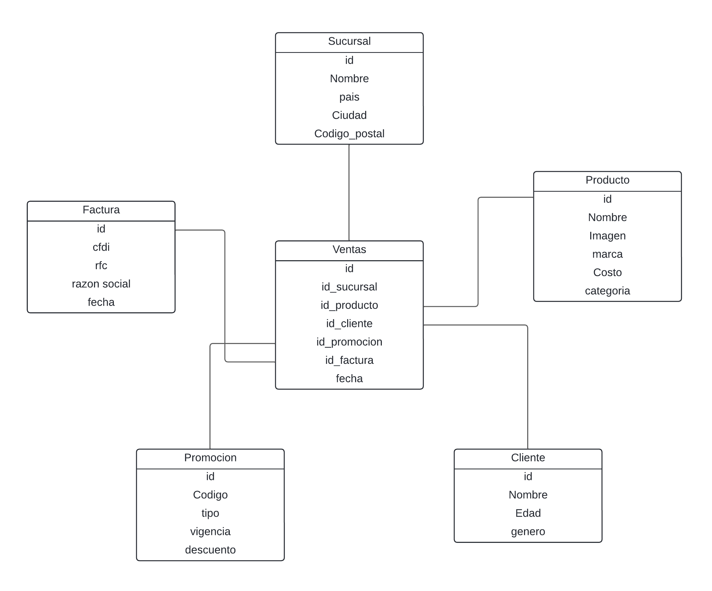
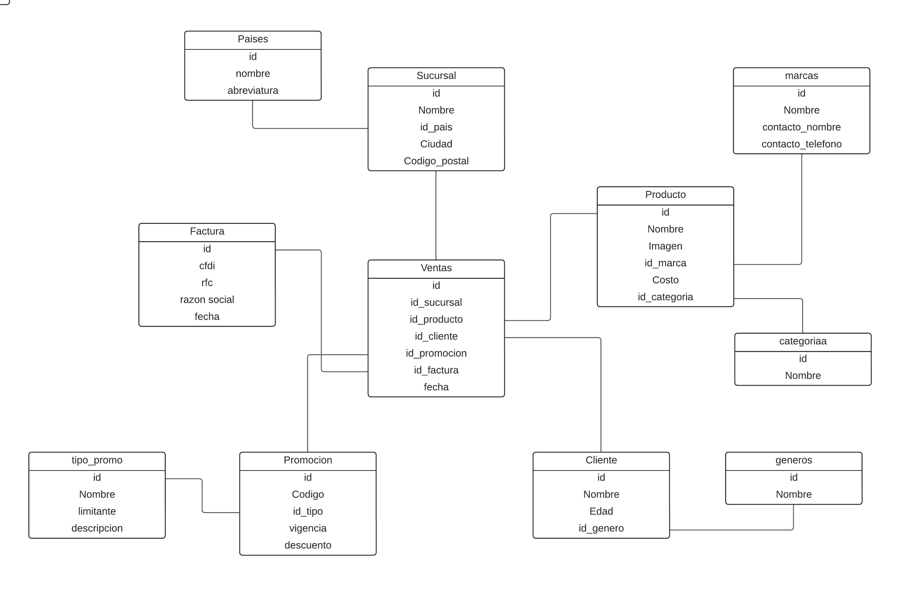

# 4. Data Warehouse

## Warehouse

Un warehouse (almacén de datos), se refiere a un repositorio centralizado y consolidado de datos. El propósito principal de un warehouse es proporcionar un entorno para el análisis y la toma de decisiones basada en datos.

Algunas características clave de un almacén de datos son:

1. **Centralización de datos**: Los datos de múltiples fuentes se integran y almacenan en un único lugar.

2. **Consolidación:** Los datos se organizan y estructuran de manera coherente para facilitar el análisis.

3. **Orientado a consultas y análisis:** Se diseñan para facilitar el acceso y la exploración de datos para la generación de informes y análisis.

4. **Optimizado para consultas complejas:** Los almacenes de datos suelen estar optimizados para realizar consultas complejas y analíticas de grandes volúmenes de datos.

En resumen, un almacén de datos proporciona una base sólida para el análisis de datos y la generación de informes al ofrecer una vista unificada y estructurada.

## Modelo estrella

## Modelo copo de nieve

