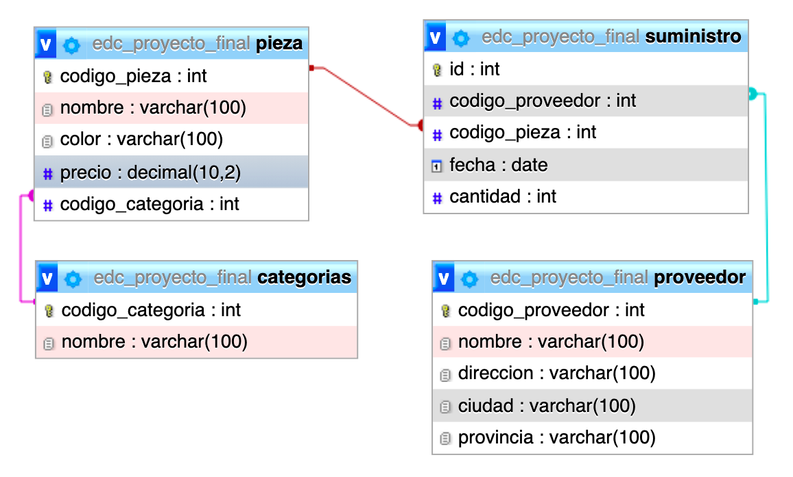

# Proyecto Final

### Modelo entidad



### Script para la base de datos

Creamos tabla de productos y fabricantes con llave foranea

```sql
CREATE TABLE fabricantes (
    codigo INT PRIMARY KEY,
    nombre VARCHAR(100) NOT NULL
);

CREATE TABLE producto (
    codigo INT PRIMARY KEY,
    nombre VARCHAR(100) NOT NULL,
    precio DECIMAL(10, 2) NOT NULL,
    codigo_fabricante INT,
    FOREIGN KEY (codigo_fabricante) REFERENCES fabricantes(codigo)
);
```

Cargamos datos en las tablas

```sql
INSERT INTO `fabricantes` (`codigo`,`nombre`) VALUES 
(1, 'Asus'),
(2, 'Lenovo'),
(3, 'Hewlett-Packard'),
(4, 'Samsung'),
(5, 'Seagate'),
(6, 'Crucial'),
(7, 'Gigabyte'),
(8, 'Huawei'),
(9, 'Xiaomi');

INSERT INTO `producto`(`codigo`, `nombre`, `precio`, `codigo_fabricante`) VALUES
(1,'Disco Duro SATA3 1TB', 86.99, 5),
(2,'Memoria RAM DDR4 8GB', 120, 6),
(3,'Disco SSD 1TB', 150.99, 4),
(4,'GeForce GTX 1050 Ti', 185, 7),
(5,'GeForce GTX1080 Xtreme', 755, 6),
(6,'Monitor 24 LED Full HD', 202, 1),
(7,'Monitor 27 LED Full HD', 245.99, 1),
(8,'Portátil Yoga 520', 559, 2),
(9,'Portátil Ideapad 320', 444, 2),
(10,'Impresora HP Deskiet 3720', 59.99, 3),
(11,'Impresora HP Laserjet Pro M26nw', 180, 3);
```


